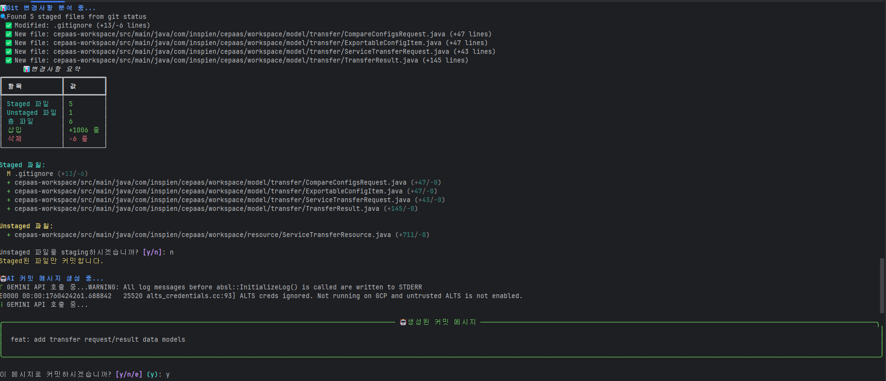

# Auto Commit - AI 기반 자동 커밋 도구 🤖

[](https://www.python.org/downloads/)
[](https://opensource.org/licenses/MIT)
[](https://github.com/chomins/autoCommitProject)

Git 변경사항을 분석하여 자동으로 의미있는 커밋 메시지를 생성하고 커밋하는 CLI 도구입니다.

> 💡 **새로운 기능**: Google Gemini 2.0 Flash 무료 지원! 더 이상 유료 API 키가 필수가 아닙니다.

## ✨ 주요 기능

- 📝 **Git 변경사항 자동 분석** - Staged/Unstaged 파일 구분, diff 추출
- 🤖 **AI 기반 커밋 메시지 생성** - Conventional Commits 형식 준수
- 💰 **Gemini 무료 할당량** 지원 (15 req/min, 추천!)
- 🔧 **다중 AI 제공자** - OpenAI, Anthropic, Google Gemini
- 🌍 **모든 프로그래밍 언어 지원** - Git 저장소라면 어디서든
- ✅ **대화형 인터페이스** - 커밋 전 확인, 메시지 편집 가능
- ⚡ **전역 설치** - 한 번 설치로 모든 프로젝트에서 사용
- 🎨 **아름다운 CLI** - Rich 라이브러리 기반 터미널 UI
- ⚙️ **유연한 설정** - 전역/프로젝트별/환경변수 설정 지원

---

## 📸 스크린샷

<p align="center">
  
</p>

---

## 🚀 빠른 설치 (전역 설치)

### 1. 저장소 클론 및 설치
```bash
git clone https://github.com/chomins/autoCommitProject.git
cd autoCommitProject
pip install -e .
```

### 2. 전역 설정 디렉토리 생성
```bash
# Windows
mkdir %USERPROFILE%\.auto-commit
copy config.yaml %USERPROFILE%\.auto-commit\
copy gemini_example.env %USERPROFILE%\.auto-commit\.env

# macOS/Linux
mkdir -p ~/.auto-commit
cp config.yaml ~/.auto-commit/
cp gemini_example.env ~/.auto-commit/.env
```

### 3. API 키 설정

**Gemini 사용 (무료, 추천!):**
```bash
# 1. https://aistudio.google.com/app/apikey 에서 API 키 발급
# 2. .env 파일 편집
notepad %USERPROFILE%\.auto-commit\.env  # Windows
nano ~/.auto-commit/.env                  # macOS/Linux
```

```env
AI_PROVIDER=gemini
GOOGLE_API_KEY=your-google-api-key-here
AI_MODEL=gemini-2.0-flash
```

**또는 OpenAI/Anthropic:**
```env
# OpenAI
AI_PROVIDER=openai
OPENAI_API_KEY=your-openai-key-here

# Anthropic
AI_PROVIDER=anthropic
ANTHROPIC_API_KEY=your-anthropic-key-here
```

### 4. 완료! 🎉

이제 **어떤 프로젝트에서든** 사용 가능합니다:

```bash
# Java 프로젝트
cd ~/projects/spring-boot-app
auto-commit

# Python 프로젝트
cd ~/projects/django-app
auto-commit

# JavaScript 프로젝트
cd ~/projects/react-app
auto-commit

# 짧은 명령어
ac
```

---

## 💡 사용 예제

### 기본 사용
```bash
auto-commit
```

### 주요 옵션
```bash
# 커밋 메시지만 확인 (실제 커밋 안함)
auto-commit --dry-run

# Staged 파일만 커밋
auto-commit --staged-only

# 특정 파일만 커밋
auto-commit --files src/main.py src/utils.py

# 확인 없이 자동 커밋 (CI/CD용)
auto-commit --auto-yes

# 자동 staging 비활성화
auto-commit --no-add

# 커스텀 설정 파일 사용
auto-commit --config custom-config.yaml

# 상세 정보 출력
auto-commit --verbose
```

### 실행 예시
```
⚙️  설정 로드 중...
📊 Git 변경사항 분석 중...

📊 변경사항 요약
┏━━━━━━━━━━━━━━━━┳━━━━━━┓
┃ 항목           ┃ 값   ┃
┡━━━━━━━━━━━━━━━━╇━━━━━━┩
│ Staged 파일    │ 0    │
│ Unstaged 파일  │ 3    │
│ 총 파일        │ 3    │
│ 삽입           │ +127 │
│ 삭제           │ -15  │
└────────────────┴──────┘

🤖 AI 커밋 메시지 생성 중...

╭──────────────────────────── 🤖 생성된 커밋 메시지 ────────────────────────────╮
│                                                                               │
│  feat: add user authentication and password validation                       │
│                                                                               │
╰───────────────────────────────────────────────────────────────────────────────╯

이 메시지로 커밋하시겠습니까? [y/n/e]: y
✅ 커밋 완료! [a3f5b2c]
feat: add user authentication and password validation
```

---

## 🌟 왜 Gemini를 추천하나요?

| 특성 | Gemini 2.0 Flash | GPT-4 Turbo | Claude 3.5 Sonnet |
|------|------------------|-------------|-------------------|
| **무료 할당량** | ✅ 15 req/min | ❌ | ❌ |
| **응답 속도** | ~1초 | ~2-3초 | ~1-2초 |
| **가격** | 무료 → $0.075/1M | $10/1M | $3/1M |
| **품질** | ⭐⭐⭐⭐ | ⭐⭐⭐⭐⭐ | ⭐⭐⭐⭐⭐ |
| **커밋 메시지 생성** | ⭐⭐⭐⭐ | ⭐⭐⭐⭐⭐ | ⭐⭐⭐⭐⭐ |

**Gemini는 무료로 시작할 수 있고 커밋 메시지 생성 품질도 훌륭합니다!**

### 지원 모델
- **Gemini**: `gemini-2.0-flash` (추천), `gemini-1.5-pro`, `gemini-1.5-flash`
- **OpenAI**: `gpt-4`, `gpt-4-turbo-preview`, `gpt-3.5-turbo`
- **Anthropic**: `claude-3-5-sonnet-20241022`, `claude-3-opus-20240229`, `claude-3-sonnet-20240229`

자세한 설정: [GEMINI_SETUP.md](GEMINI_SETUP.md)

---

## 🔧 커스터마이징

### 전역 설정
`~/.auto-commit/config.yaml` 편집:

```yaml
ai:
  model: "gemini-2.0-flash"
  temperature: 0.1    # 0.0 ~ 1.0, 낮을수록 일관적
  max_tokens: 80      # 커밋 메시지용 짧게 설정

commit:
  conventional_commits: true
  max_subject_length: 72
  include_file_list: true
  types:
    - feat
    - fix
    - docs
    - style
    - refactor
    - test
    - chore
    - perf
    - ci
    - build

git:
  auto_add: false     # true면 자동으로 파일 staging
  exclude_patterns:
    - "*.log"
    - "*.tmp"
    - ".env"
    - "__pycache__/"
```

### 프로젝트별 설정
프로젝트 루트에 `.auto-commit.yaml` 생성:

```yaml
ai:
  model: "gemini-1.5-pro"  # 이 프로젝트만 다른 모델 사용
  temperature: 0.2

git:
  auto_add: true           # 이 프로젝트는 자동 staging 활성화
```

### 환경 변수로 설정 오버라이드
`.env` 파일이나 환경 변수로 일시적 설정 변경:

```bash
AI_MODEL=gpt-4              # 모델 변경
AI_TEMPERATURE=0.3          # Temperature 조정
AI_MAX_TOKENS=100           # 토큰 수 조정
```

---

## 💡 사용 팁

### 1. 커밋 메시지 품질 향상
- **Temperature 조정**: `0.1-0.2` 추천 (일관성 있는 메시지)
- **Diff 확인**: 커밋 전 변경사항을 명확히 이해
- **파일 분할**: 큰 변경사항은 논리적 단위로 분할 커밋

### 2. 워크플로우 최적화
```bash
# 1. 코드 작성 후
git status                    # 변경사항 확인

# 2. 자동 커밋
auto-commit                   # AI가 메시지 생성

# 3. 또는 특정 파일만
auto-commit --files src/*.py  # Python 파일만 커밋

# 4. 빠른 확인
auto-commit --dry-run         # 메시지만 보기
```

### 3. CI/CD 통합
```yaml
# GitHub Actions 예제
- name: Auto Commit
  run: |
    pip install -e .
    auto-commit --auto-yes
  env:
    AI_PROVIDER: gemini
    GOOGLE_API_KEY: ${{ secrets.GOOGLE_API_KEY }}
```

### 4. Git Hooks와 함께 사용
```bash
# .git/hooks/pre-commit
#!/bin/bash
auto-commit --dry-run --verbose
```

---

## 🌍 모든 언어 지원

Auto Commit은 **Git을 사용하는 모든 프로젝트**에서 작동합니다:

✅ Java (Spring Boot, Maven, Gradle)  
✅ Python (Django, Flask, FastAPI)  
✅ JavaScript/TypeScript (React, Vue, Angular, Node.js)  
✅ Go, Rust, C++, C#, Ruby, PHP, Swift, Kotlin  
✅ 그 외 모든 Git 프로젝트

---

## 📚 문서

- **[GEMINI_SETUP.md](GEMINI_SETUP.md)** - Gemini 무료 사용 가이드

---

## 🛠️ 문제 해결

### "API key not valid" 또는 "GOOGLE_API_KEY 환경 변수가 설정되지 않았습니다"
**원인**: API 키가 설정되지 않았거나 잘못됨

**해결**:
1. `.env` 파일 위치 확인:
   ```bash
   # 전역 설정
   ls ~/.auto-commit/.env     # macOS/Linux
   dir %USERPROFILE%\.auto-commit\.env  # Windows
   
   # 또는 현재 프로젝트
   ls .env
   ```

2. API 키 발급 및 설정:
   - **Gemini**: https://aistudio.google.com/app/apikey
   - **OpenAI**: https://platform.openai.com/api-keys
   - **Anthropic**: https://console.anthropic.com/

3. `.env` 파일에 올바르게 입력:
   ```bash
   AI_PROVIDER=gemini
   GOOGLE_API_KEY=your-actual-api-key-here
   AI_MODEL=gemini-2.0-flash
   ```

### "Module not found: google.generativeai" 또는 다른 import 오류
**원인**: 필요한 Python 패키지가 설치되지 않음

**해결**:
```bash
# 모든 의존성 재설치
pip install -r requirements.txt

# 또는 전역 재설치
pip install -e .
```

### "변경사항이 없습니다"
**원인**: Git에서 감지할 변경사항이 없음

**해결**:
```bash
# 변경사항 확인
git status

# 파일 staging (필요한 경우)
git add .

# 또는 unstaged 파일도 포함
auto-commit  # 대화형으로 staging 여부 물어봄
```

### "지원하지 않는 provider"
**원인**: `.env` 파일의 `AI_PROVIDER` 값이 잘못됨

**해결**: 다음 중 하나로 설정
```bash
AI_PROVIDER=gemini      # 추천
AI_PROVIDER=openai
AI_PROVIDER=anthropic
```

### Windows에서 명령어를 찾을 수 없음
**원인**: Python Scripts 디렉토리가 PATH에 없음

**해결**:
```powershell
# Python Scripts 경로 추가 (보통 여기에 설치됨)
# 시스템 환경 변수에 다음 경로 추가:
%USERPROFILE%\AppData\Local\Programs\Python\Python3XX\Scripts

# 또는 직접 실행
python -m auto_commit
```

---

## 📝 커밋 메시지 형식

Conventional Commits 형식을 따릅니다:

- `feat`: 새로운 기능
- `fix`: 버그 수정
- `docs`: 문서 수정
- `refactor`: 코드 리팩토링
- `test`: 테스트 추가/수정
- `chore`: 빌드, 설정 수정
- `perf`: 성능 개선

---

## 🔗 유용한 링크

### API 키 발급
- **Gemini API 키** (무료!): https://aistudio.google.com/app/apikey
- **OpenAI API 키**: https://platform.openai.com/api-keys
- **Anthropic API 키**: https://console.anthropic.com/

### 문서 및 가이드
- **Conventional Commits**: https://www.conventionalcommits.org/
- **GitPython 문서**: https://gitpython.readthedocs.io/
- **Rich 라이브러리**: https://rich.readthedocs.io/

### 프로젝트 저장소
- **GitHub**: https://github.com/chomins/autoCommitProject
- **Issues**: https://github.com/chomins/autoCommitProject/issues

---

## 📦 프로젝트 구조

```
autoCommitProject/
├── auto_commit.py              # 메인 CLI 진입점 (전역 명령어)
├── git_analyzer.py             # Git 저장소 분석 및 변경사항 추출
├── commit_message_generator.py # AI 기반 커밋 메시지 생성
│                               # - OpenAIProvider
│                               # - AnthropicProvider  
│                               # - GeminiProvider
├── config_manager.py           # 설정 로드 및 검증
│                               # - 전역 설정 (~/.auto-commit/)
│                               # - 프로젝트별 설정 (.auto-commit.yaml)
│                               # - 환경 변수 오버라이드
├── config.yaml                 # 기본 설정 파일 (템플릿)
├── gemini_example.env          # Gemini 설정 예제
├── setup.py                    # 전역 설치 설정
├── requirements.txt            # Python 의존성 목록
├── README.md                   # 프로젝트 문서 (이 파일)
├── GEMINI_SETUP.md             # Gemini 상세 가이드
└── result/                     # 실행 결과 스크린샷
    ├── result-init-version.png
    └── result-modified-version.png
```

### 핵심 모듈 설명

#### `auto_commit.py`
- CLI 진입점 및 사용자 인터페이스
- Rich 라이브러리를 사용한 아름다운 터미널 출력
- 대화형 커밋 확인 및 메시지 편집 기능

#### `git_analyzer.py`
- GitPython을 사용한 Git 저장소 분석
- Staged/Unstaged 파일 구분
- 변경사항 diff 추출 및 통계

#### `commit_message_generator.py`
- 3개 AI 제공자 지원 (OpenAI, Anthropic, Gemini)
- Conventional Commits 형식 준수
- 상세한 프롬프트 엔지니어링으로 고품질 메시지 생성

#### `config_manager.py`
- 계층적 설정 관리 (기본 → 전역 → 프로젝트 → 환경변수)
- YAML 설정 파일 및 .env 통합
- API 키 검증 및 안전한 로드

---

## 📄 라이센스

MIT License - 자유롭게 사용, 수정, 배포 가능합니다.

---

## 🎯 빠른 요약

```bash
# 1. 설치
git clone https://github.com/chomins/autoCommitProject.git
cd autoCommitProject
pip install -e .

# 2. 전역 설정 (macOS/Linux)
mkdir -p ~/.auto-commit
cp config.yaml ~/.auto-commit/
cp gemini_example.env ~/.auto-commit/.env

# 2. 전역 설정 (Windows)
mkdir %USERPROFILE%\.auto-commit
copy config.yaml %USERPROFILE%\.auto-commit\
copy gemini_example.env %USERPROFILE%\.auto-commit\.env

# 3. API 키 설정
# ~/.auto-commit/.env 파일 편집 (또는 %USERPROFILE%\.auto-commit\.env)
# AI_PROVIDER=gemini
# GOOGLE_API_KEY=your-api-key-here

# 4. 사용
cd your-project
auto-commit
```

**끝! 🚀**

---

## 🤝 기여하기

버그 리포트, 기능 제안, Pull Request를 환영합니다!

- **Issues**: https://github.com/chomins/autoCommitProject/issues
- **Pull Requests**: https://github.com/chomins/autoCommitProject/pulls

---

## 📊 버전 정보

**현재 버전**: 1.0.0

### 주요 기능
- ✅ Gemini, OpenAI, Anthropic 지원
- ✅ 전역 설치 및 설정
- ✅ Conventional Commits 형식
- ✅ 대화형 커밋 확인
- ✅ 다양한 CLI 옵션
- ✅ 프로젝트별 설정 오버라이드
